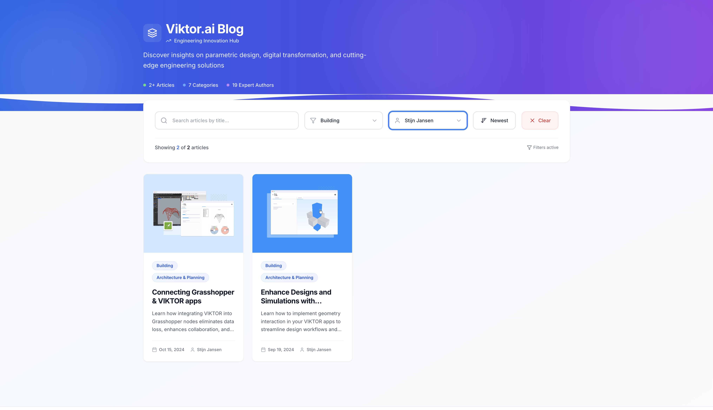

# Viktor.ai Blog Grid - Frontend Assessment

This project is a high-performance blog grid built with React and Redux, demonstrating a scalable architecture focused on performance and user experience.

## 🏗️ Architecture & Caching Strategy

### State Management
We use **Redux Toolkit** for a centralized, scalable state. This provides a single source of truth for posts, filters, and cache, which is essential for an enterprise-grade application.

### API Response Caching (JSON)
All API responses (like blog posts and categories) are cached in Redux with a 5-minute TTL.
* **Why?** To provide instant navigation to previously visited pages and dramatically reduce server load. A cache key (e.g., `posts_1_search_...`) ensures each filter set is cached.

### Image Caching (In Redux)
We deliberately cache critical images

**Key Benefits:**
1.  **Instant Renders**: Images load from memory (sub-10ms) instead of the browser's disk cache (100ms+), **completely eliminating UI flicker** on navigation.
2.  **Offline-First**: When combined with `redux-persist`, this allows the app to be fully functional without a network connection.
3.  **Programmatic Control**: We can now "warm" the cache by preloading images for adjacent pages *before* the user clicks, guaranteeing an instant transition.

### Caching Strategy at a Glance

| Data Type | Cache Location | TTL | Reasoning |
|:---|:---|:---|:---|
| Blog Posts (JSON) | Redux State | 5 min | Small, frequently accessed, needs invalidation. |
| Categories (JSON) | Redux State | 30 min | Static, rarely changes. |
| User Preferences | `localStorage` | Persistent | Must survive page refresh. |

---

## 📚 Tech Stack

| Technology | Purpose |
|:---|:---|
| **React 18** | Modern UI library with hooks |
| **TypeScript** | Type safety and scalability |
| **Redux Toolkit** | Centralized state management & caching |
| **Tailwind CSS** | Rapid, utility-first styling |
| **Lucide React** | Lightweight, tree-shakeable icons |

## 📸 Screenshots

### Main Blog Grid

### Filters and Smart Pagination

### Mobile Responsive View

### Tab Responsive View
